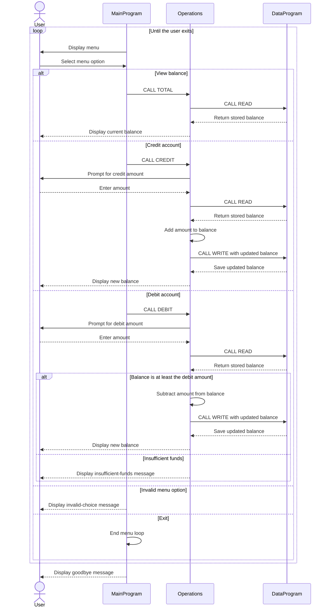

# COBOL Account Management

This directory documents the COBOL account-management example in `src/cobol`. The program provides a menu for viewing an account balance, crediting the account, debiting the account, and exiting.

## Source Files

### `main.cob`

The `MainProgram` is the command-line entry point. It displays the menu and loops until the user selects exit. It dispatches the balance, credit, and debit choices to `Operations`, and reports invalid menu selections.

### `operations.cob`

The `Operations` program handles account actions based on the operation passed by `MainProgram`:

- `TOTAL`: reads the stored balance and displays it.
- `CREDIT`: accepts an amount, reads the balance, adds the amount, writes the updated balance, and displays it.
- `DEBIT`: accepts an amount, reads the balance, and subtracts and saves the amount only when the balance is at least that amount. Otherwise it displays an insufficient-funds message.

### `data.cob`

The `DataProgram` owns the balance storage. It supports `READ`, which copies the stored balance to the caller, and `WRITE`, which replaces the stored balance with the caller-provided value. The balance is initialized to `1000.00` when the program's storage is initialized.

## Account Rules and Scope

- The starting account balance is `1000.00`.
- Credits add the entered amount to the balance.
- Debits are allowed only when the current balance is greater than or equal to the requested amount; this prevents a debit that exceeds the available balance.
- A rejected debit does not write a changed balance.
- The code does not model student identity, enrollment, tuition, fees, or student-specific eligibility. It manages a single generic account balance; no additional student-account business rules are implemented.
- The operation logic contains no explicit validation for positive amounts or other amount limits.

## Data Flow

